# 3. Domínios e Serviços

## 3.1 Domínios de Negócio

O projeto é organizado em **5 domínios de negócio**, cada um responsável por um conjunto coeso de dados e serviços:

### Domínio 1 — Vendas
Responsável pelos dados de pedidos, transações e pagamentos.
**Serviços:** Serviço de Pedidos, Serviço de Pagamentos, Serviço de Devoluções.

### Domínio 2 — Catálogo e Estoque
Responsável pelos dados de produtos, categorias, preços e disponibilidade em estoque.
**Serviços:** Serviço de Produtos, Serviço de Estoque, Serviço de Precificação.

### Domínio 3 — Cliente e Comportamento
Responsável pelos dados cadastrais dos clientes e pelo rastreamento de comportamento no site/app.
**Serviços:** Serviço de Clientes, Serviço de Eventos (clickstream), Serviço de Recomendações.

### Domínio 4 — Logística
Responsável pelo rastreamento de entregas, status de pedidos e desempenho de transportadoras.
**Serviços:** Serviço de Rastreamento, Serviço de Transportadoras, Serviço de SLA de Entrega.

### Domínio 5 — Marketing
Responsável por campanhas, aquisição de clientes e análise de performance de canais.
**Serviços:** Serviço de Campanhas, Serviço de Segmentação, Serviço de Atribuição.

---

## 3.2 Serviços Compartilhados entre Domínios

| Serviço Compartilhado | Consumidores |
|---|---|
| Serviço de Identidade (id_cliente) | Vendas, Cliente, Marketing, Logística |
| Serviço de Notificações | Vendas, Estoque, Logística |
| Serviço de Qualidade de Dados | Todos os domínios |
| Serviço de Catálogo de Metadados | Todos os domínios |

---

## 3.3 Diagrama de Domínios e Serviços

```mermaid
graph TD
    subgraph Vendas
        S1[Serviço de Pedidos]
        S2[Serviço de Pagamentos]
        S3[Serviço de Devoluções]
    end

    subgraph Catalogo_e_Estoque
        S4[Serviço de Produtos]
        S5[Serviço de Estoque]
        S6[Serviço de Precificação]
    end

    subgraph Cliente_e_Comportamento
        S7[Serviço de Clientes]
        S8[Serviço de Eventos - Clickstream]
        S9[Serviço de Recomendações]
    end

    subgraph Logistica
        S10[Serviço de Rastreamento]
        S11[Serviço de Transportadoras]
        S12[Serviço de SLA de Entrega]
    end

    subgraph Marketing
        S13[Serviço de Campanhas]
        S14[Serviço de Segmentação]
        S15[Serviço de Atribuição]
    end

    subgraph Servicos_Compartilhados
        SC1[Identidade do Cliente]
        SC2[Notificações]
        SC3[Qualidade de Dados]
        SC4[Catálogo de Metadados]
    end

    S1 --> SC1
    S7 --> SC1
    S13 --> SC1
    S10 --> SC1
    S1 --> SC2
    S5 --> SC2
    S10 --> SC2
    S1 --> SC3
    S4 --> SC3
    S8 --> SC3
    S13 --> SC3
```

