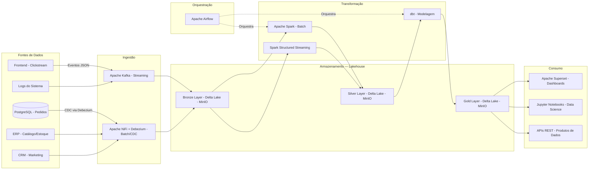

# 4. Arquitetura — Fluxo de Dados

## 4.1 Tipo de Arquitetura Escolhida: Lakehouse

A arquitetura escolhida para o DataFlow Commerce é a **Lakehouse**, combinando características do Data Lake (armazenamento de baixo custo, suporte a dados brutos e semiestruturados) com características do Data Warehouse (suporte a transações ACID, esquema, qualidade e performance de consultas analíticas).

### Justificativa da Escolha

- **Data Warehouse puro** seria insuficiente pois não trata bem dados não estruturados como logs e eventos JSON de streaming.
- **Data Lake puro** resolve o armazenamento, mas não garante qualidade, consistência e performance para consultas analíticas.
- **Lakehouse** (implementado com Delta Lake sobre MinIO) resolve os dois problemas: armazena qualquer tipo de dado bruto, mas com suporte a ACID, time travel, schema enforcement e performance de leitura analítica.
- O projeto tem tanto cargas **batch** quanto **streaming**, o que se alinha ao modelo **Lambda Architecture** implementado sobre o Lakehouse.

---

## 4.2 Camadas do Lakehouse (Padrão Medallion)

| Camada | Nome | Descrição |
|---|---|---|
| Bronze | Raw / Ingestão | Dados brutos exatamente como chegaram, sem transformação. Imutáveis. |
| Silver | Refinado | Dados limpos, tipados, deduplicados e com schema validado. |
| Gold | Analítico | Dados agregados, modelados em estrela, prontos para consumo. |

---

## 4.3 Diagrama de Arquitetura — Fluxo Ponta a Ponta

---

## 4.4 Caminhos de Batch e Streaming

### Caminho Batch
PostgreSQL / ERP / CRM → Apache NiFi (extração) → Bronze (Delta Lake) → Apache Spark (limpeza) → Silver (Delta Lake) → dbt (modelagem) → Gold (Delta Lake) → Superset / Notebooks

**Frequência:** diária, agendada pelo Airflow às 02h00.

### Caminho Streaming
Frontend / Logs → Apache Kafka (tópicos por domínio) → Bronze (Delta Lake) → Spark Structured Streaming → Silver (Delta Lake) → Superset (near-real-time)

**Latência alvo:** menos de 30 segundos da origem ao consumo.

---

## 4.5 Trade-offs Arquiteturais

| Decisão | Escolha | Alternativa Descartada | Justificativa |
|---|---|---|---|
| Arquitetura geral | Lakehouse (Medallion) | Data Warehouse puro | Suporte a dados não estruturados e streaming |
| Padrão de fluxo | Lambda (batch + streaming) | Kappa (só streaming) | Batch é mais simples e barato para dados históricos |
| Armazenamento | MinIO + Delta Lake | HDFS | MinIO é compatível com S3, open-source e local |
| Acoplamento | Kafka como barramento | Integração ponto-a-ponto | Kafka desacopla produtores de consumidores |
| Escalabilidade | Particionamento por data/domínio | Tabela monolítica | Permite leituras eficientes sem scan total |
| Disponibilidade | Replicação Kafka (fator 3) | Sem replicação | Garante zero perda de mensagens |
| Reversibilidade | Bronze imutável (append-only) | Sobrescrever dados brutos | Permite reprocessamento a partir do zero |
